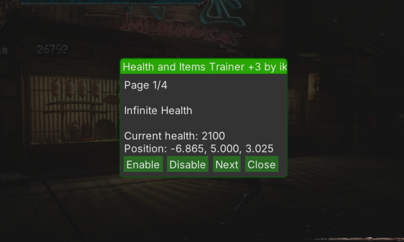


Ninja Gaiden II Health and Items Trainer +3 by ike9000
------------------------------------------------------------

	Trainer for Ninja Gaiden II, Xbox 360 game. 
	Plugin XEX for Xenia emulator.

	Press DpadLeft+RightShoulder+LeftTrigger to open UI popup.
	
	Compatibility:
	
	* TU3       - Working.
	* TU2       - Working. Compatibility is uncertain.
	* No TU     - Not Working.

Installation
------------------

	Unpack the archive.
	
	Copy contents of the archive to the folder whre Xenia 
	load its plugins from. Should be "...\plugins\544307D5".
	
	If "plugins.toml" file already exists, 
	edit it and add the [[plugin]] section that refers to 
	this plugin.

	In Xenia, plugins needs to be enabled.
	Go to Configuration - General, make sure "allow_plugins" is enabled.

Website
-----------
	
	https://github.com/ike9000e/ngii-health-plus-3-trainer
